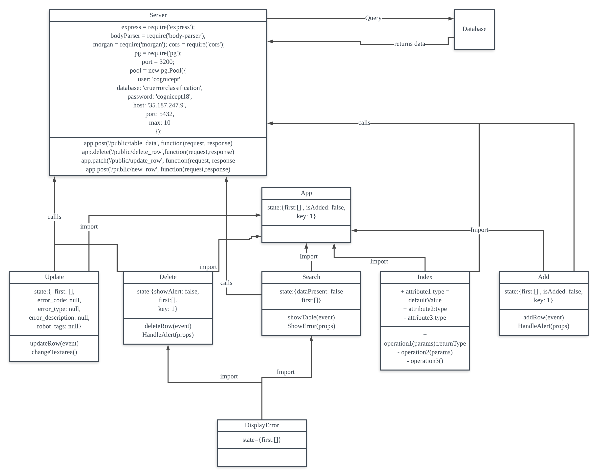
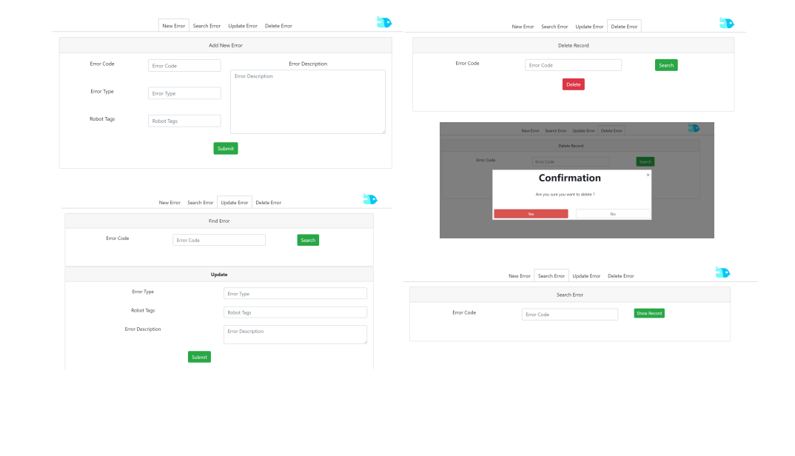

# README #

# Intro #
* CRUD for error details.
* Add.js adds new records,  Search.js searches for existing records, Delete.js deletes existing records, Update.js updates existing records.
* Add.js, Search.js, Delete.js, Update.js uses Server.js functions to query the Postgresql databasez
* Add.js uses addRow(event) to send a post request to server.js which then communicates with the database
* Search.js uses findRow(event) to send a post request to server.js which then communicates with the database
* Update.js uses updateRow(event) to send a patch request to server.js which then communicates with the database
* Delete.js uses deleteRow(event) to send a delete request to server.js which then communicates with the database
* Using postgresql, reactjs, and bootstrap.
* extra react libraries include : react-flash-message , reactstrap, react-file-reader, reactjs-popup,react-flash-message, ag-grid-react,csvtojson

### How do I get set up? ###
* Open 2 cmd, enter into the directory of the project in both cmd.
* Run npm start and node server.js in the 2 separate cmd
* npm start will start the website on localhost:3200
* node server.js will establish connection to postgresql database.
* run pgAdmin 4 for a direct interface with the database

## Database Postgresql Connection Details##
* user: 'cognicept',
* database: 'cruerrorclassification',
* password: 'cognicept18',
* host: '35.187.247.9',
* port: 5432,
* max: 10

## Things to Take note of in DisplayDatabase.js ##
* ag-grid nodes return all arrays in their own format which must be parse into string then converted back into array look at DisplayDatabase.js line:93
* All comparisions in ag-grid is done in upper case
* Database.js filter input requires " " to recognise a robot tag, do not put " " to filter via error_code
* ag-grid is controlled by this.state.rowData , change rowData will rerender ag-grid.
* Queries made to the database that retrieves resolution must include timezone in query see file for example.
* GET queries are slower than UPDATE queries so I used setTimeout() to ensure proper update of database before issuing a GET request
* execel file uploaded must be in CSV format comma delimited.
* CSV file must contain columns headers labelled as "Error Code" , "Error Type","Robot Tags","Error Description"
* Search Error window uses data from the ag-grid to populate it. Except when rowNode is updated. Because resolution is determiend by the database, a call back to the database must be made to retrieve updates
* Upload function only takes 1 file at a time, this can be improve to tke multiple files at a time.

### Other Things to Note ###
* All flash messages persist until new calls are made or when the tab is switched
* flash messages are controlled by boolean values or strings to obtain tristate values see updatel.js for example
* CRUD is made such that Error Code cannot be modified.

### Database table structure ###
| Column Name     | Data Type    |
| --------|---------|
| UUID | UUID, generated by PSOTGRESQL |
| Error Code  | String PK |
| Error Type| String |
| Error Description| String |
| Robot Tags | Array separated by ","|
| Resolution | Timestamp with time zone generated by POSTGRESQL|

## Architecture Diagram##

## Wireframe ##

