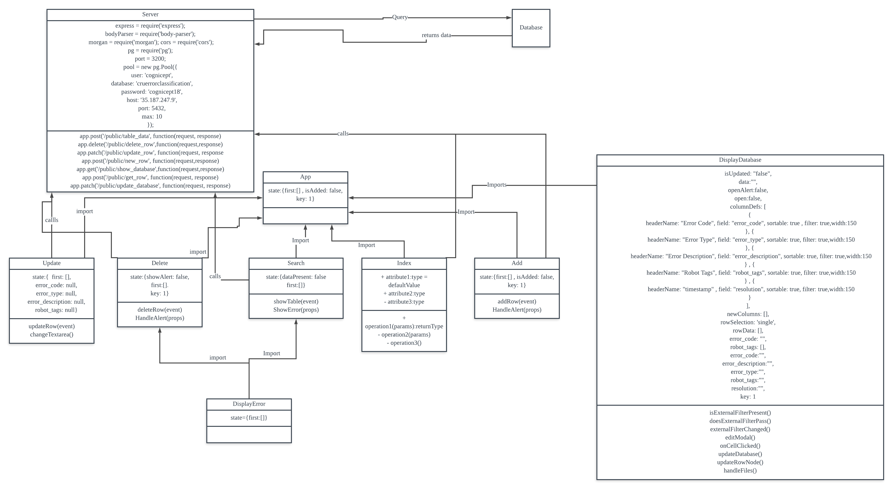

# README #

# Intro #
* CRUD for error details
* Using postgresql, reactjs, react libraries and bootstrap.
### How do I get set up? ###
* Summary of set up
* Enter directory of project in CMD then Run npm start and node server.js in 2 separate cmd
## Database structure ##

## Architecture Diagram##

* 6 columns
* error_type: string
* error_description: string
* robot_tags: string
* resolution: timestamp without time zone
* error_code: string (PK) no duplicates and null allowed.

## Wireframe ##

